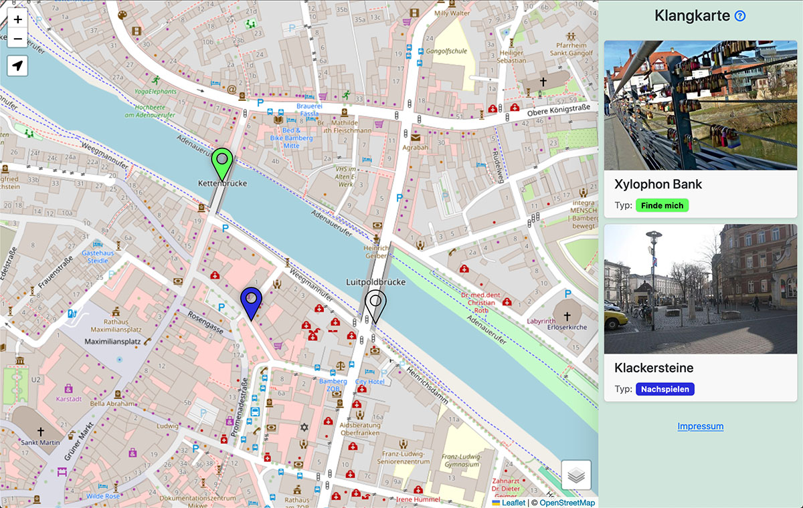

# Klangkarte

Django app for managing places with json export and a fully-static frontend map.




## Deploy

Start container with `docker-compose up -d` and create admin user (first-run only):

```sh
docker-compose exec app python manage.py createsuperuser --email ''
```

Further, the frontend needs the three Content labels `info`, `imprint`, and `come-back-later`. You can either, create them manually, or run:

```sh
docker-compose exec app python manage.py loaddata initial.json
```
